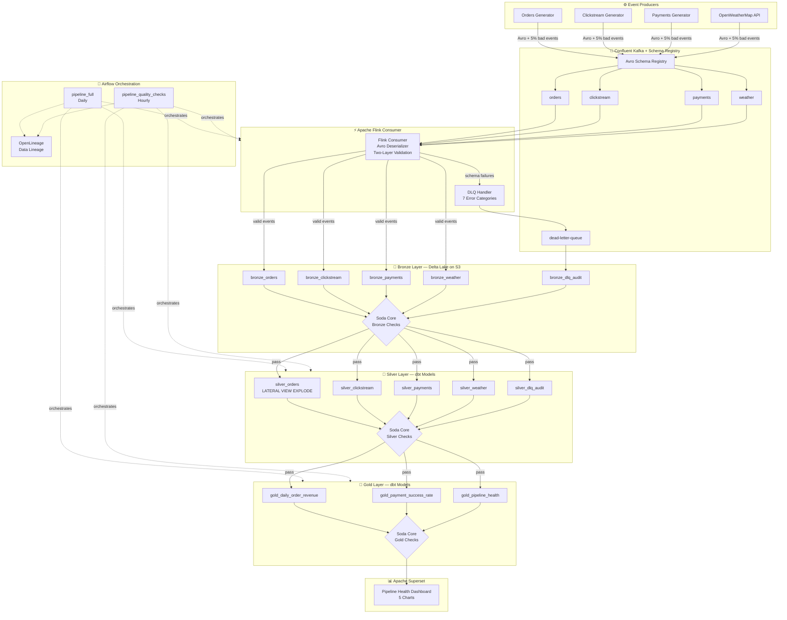

# Contract-Driven Streaming Data Platform


> A production-grade event streaming platform with schema enforcement, medallion architecture, and data quality contracts baked in at every layer — not bolted on after.

---

## The Problem

Most data pipelines fail silently. A schema changes upstream, a field goes null, an amount flips negative — and corrupted data flows into dashboards and reports undetected. By the time someone notices, hours or days of decisions have been made on bad numbers.

This platform answers a different question: **what does a pipeline look like that refuses to trust its own data?**

- Schema violations are rejected at the **producer**, before they enter Kafka
- Malformed events are quarantined to a **Dead Letter Queue** with structured error metadata
- Data quality contracts are enforced at **every layer transition** — Bronze → Silver → Gold
- Contract violations are visible in a **live dashboard** within minutes

---

## Architecture



---

## Stack

| Concern | Technology |
|---|---|
| Event streaming | Confluent Kafka (Cloud) |
| Schema enforcement | Confluent Schema Registry — Avro |
| Stream processing | Apache Flink (PyFlink micro-batch) |
| Storage | Delta Lake on AWS S3 |
| Transformation | dbt with Spark adapter |
| Data quality | Soda Core — 75 checks across 3 layers |
| Orchestration | Apache Airflow — 2 DAGs |
| Lineage | OpenLineage / Marquez |
| Observability | Apache Superset |
| Infrastructure | Terraform, Docker Compose |
| Language | Python 3.11+ |

---

## Key Metrics

| Metric | Value |
|---|---|
| Kafka topics | 5 (orders, clickstream, payments, weather, DLQ) |
| Avro schemas registered | 4 (Schema IDs 100001–100004) |
| DLQ error categories | 7 structured error types |
| Soda data quality checks | 75 across 13 YAML files, 3 layers |
| dbt models | 8 (5 Silver + 3 Gold) |
| Airflow DAGs | 2 (daily full + hourly quality) |
| Superset charts | 5 |
| Unit tests | 21 (no live infrastructure required) |
| End-to-end validation | 12/12 checks green |

---

## Project Structure

```
contract-driven-platform/
├── producers/              # 4 Kafka producers with ~5% fault injection
│   ├── base_producer.py
│   ├── orders_producer.py
│   ├── clickstream_producer.py
│   ├── payments_producer.py
│   └── weather_producer.py
├── flink/                  # Flink consumer + Bronze writer + DLQ handler
│   ├── flink_consumer.py
│   ├── bronze_writer.py
│   └── dlq_handler.py
├── bronze/                 # Bronze Delta Lake schemas
│   └── bronze_schema.py
├── dbt_project/            # dbt Silver → Gold transformations
│   ├── models/
│   │   ├── silver/         # 5 Silver models (cleanse + validate)
│   │   └── gold/           # 3 Gold models (business aggregates)
│   └── dbt_project.yml
├── soda/                   # 75 Soda Core quality checks
│   ├── bronze/
│   ├── silver/
│   └── gold/
├── dags/                   # Airflow DAGs
│   ├── pipeline_orchestrator.py
│   └── contract_validation_dag.py
├── config/                 # Centralised config (env-loaded)
│   └── flink_config.py
├── observability/          # Superset dashboard exports
│   └── dashboards/
├── tests/                  # Unit tests — no live infra needed
│   └── test_day4_bronze.py
├── infra/                  # Terraform stubs
├── docker-compose.yml
├── requirements.txt
├── .env.example
└── CASE_STUDY.md           # Full architecture write-up
```

---

## Data Quality Contract

The core design principle: data contracts are enforced at **write time**, not discovered at query time.

**Layer 1 — Schema Registry (Producer → Kafka)**
Every event must conform to a registered Avro schema before it enters a Kafka topic. Non-conforming events never reach the consumer.

**Layer 2 — Flink Validation (Kafka → Bronze)**
Two-pass validation on every consumed message:
1. Structural check — required fields present, correct types
2. Business rule check — amounts positive, timestamps in range, enums valid

Events failing either check are routed to the Dead Letter Queue with a structured error header:

```
error_type: VALUE_OUT_OF_RANGE
source_topic: payments
original_offset: 10482
error_detail: amount=-14.50 violates amount > 0 contract
```

**Layer 3 — Soda Core (Bronze → Silver → Gold)**
75 automated checks block promotion at each layer transition. A failing check halts the Airflow DAG — no partial data reaches downstream consumers.

```yaml
# Example: silver_payments Soda check
checks for silver_payments:
  - row_count > 0
  - missing_count(payment_id) = 0
  - invalid_count(amount) = 0:
      valid min: 0.01
  - invalid_percent(currency) < 1:
      valid values: [USD, EUR, GBP, INR, JPY]
```

---

## Running Locally

**Prerequisites:** Python 3.11+, Confluent Cloud account, Docker

```bash
# Clone and configure
git clone https://github.com/arcofiero/contract-driven-platform
cd contract-driven-platform
cp .env.example .env
# Edit .env — add Confluent Cloud credentials

# Install dependencies
pip install -r requirements.txt

# Start all producers (fires ~5% bad events automatically)
python run_all_producers.py

# Run Flink consumer — writes Delta tables to /tmp/delta/ by default
python flink/flink_consumer.py

# Run dbt transformations
cd dbt_project && dbt run --profiles-dir ~/.dbt && cd ..

# Run all 75 Soda quality checks
python run_soda_checks.py

# Trigger full pipeline via Airflow
airflow dags trigger pipeline_full
```

For Delta Lake on S3, set `USE_S3=true` and configure `AWS_ACCESS_KEY_ID`, `AWS_SECRET_ACCESS_KEY`, `S3_BUCKET` in `.env`.

---

## Design Decisions

**Why Avro over JSON?**
Avro enforces schema at the producer — a malformed event fails before it enters Kafka, not hours later when a downstream model breaks. Schema evolution is explicit and versioned in the registry.

**Why ~5% intentional bad events?**
The Dead Letter Queue is a first-class feature, not a failure mode. Bad events demonstrate that the platform catches, categorises, and audits failures in real time. Every demo run shows live violations in the pipeline health dashboard.

**Why Delta Lake over plain Parquet?**
ACID transactions, schema enforcement at write time, and time travel. The Bronze layer retains full history — any Silver model can be recomputed from the original raw records.

**Why two Airflow DAGs?**
Hourly quality checks decouple contract validation from ingest frequency. A schema drift or data anomaly is visible within an hour, even when the full pipeline runs daily.

**Why at-least-once semantics in Flink?**
Simpler to operate and reason about for a Bronze ingest layer. Exactly-once would require transactional producers and coordinated Delta checkpointing — the right call for payments at scale, noted as a future improvement.

---

## What's Next

- **Exactly-once semantics** — transactional Kafka producers + Delta Lake checkpointing for the payments topic
- **Real Flink cluster** — proper streaming topology with watermarking and windowed aggregations (currently micro-batch)
- **Terraform automation** — stubs exist in `infra/`; wiring up would make the full environment reproducible from `terraform apply`
- **dbt/Soda consolidation** — dbt schema YAML already defines column contracts; a future iteration could replace Soda with native dbt tests

---

## Case Study

Full architecture write-up, day-by-day build log, and engineering rationale: [CASE_STUDY.md](./CASE_STUDY.md)

---

*Built by [Archit Raj](https://github.com/arcofiero)*
